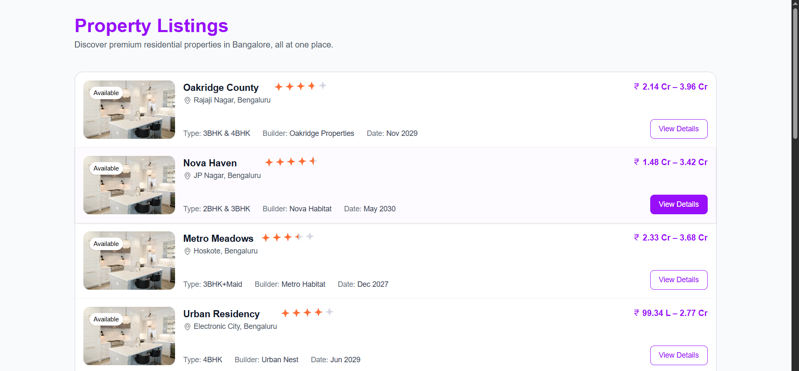

# 🗺️ Property Discovery Map — Assignment Submission

A property discovery experience built with **Next.js (App Router)** and **React Leaflet**, focusing on map-based exploration, clean UX, and Correct Server side Rendering.

This repository contains the **completed solution** for the frontend engineer assignment.  
All TODOs and functional issues mentioned in the original codebase have been addressed.

---

## 📌 Assignment Objective

The goal of this assignment was to:

- Fix UI/UX issues in the property discovery map
- Resolve SSR-related errors caused by Leaflet
- Improve marker interaction and popup behavior
- Implement a list view with pagination

---

## ✅ What was completed

### 1. Discovery Map Improvements (`components/discovery-map.tsx`)

#### - Marker overlap & clutter (TODO resolved)
- Implemented **marker clustering** using `react-leaflet-cluster`
- Prevents overlapping markers when zoomed out
- Improves readability and interaction on dense areas

#### - Marker click interaction (TODO resolved)
- Clicking a marker now:
  - Selects the property
  - Animates the map to the marker location
  - Opens the corresponding popup programmatically

#### SSR-safe Leaflet integration (TODO resolved)
- Removed direct Leaflet imports from Server Components
- Ensured all Leaflet usage runs **only in Client Components**
- Eliminated `window is not defined` runtime errors

---

### 2. Page & Listing View (`src/app/page.tsx`)

#### - Server-side rendering (SSR)
- Page is implemented as a **Server Component**
- No `"use client"` directive added
- All data slicing and pagination logic runs on the server

#### - List view implementation (TODO resolved)
- Added both:
  - Desktop list view
  - Mobile grid view
- Designed independently 

#### - Pagination (TODO resolved)
- Pagination implemented using **URL search params**
- Example: `/page=2`
- Benefits:
  - SEO-friendly
  - Shareable URLs
  - Works without client-side state

---

### 3. Pagination Component

- Clean, reusable pagination component
- Uses `next/link` (no client-side state)
- Accessibility handled with:
  - `aria-current`
  - Disabled navigation states
- Sliding window for page numbers

---

## 🧠 Technical Approach

### Server-first mindset
- Listings, and pagination handled on the server
- Client components only used where necessary (map)

### Minimal but correct fixes
- No unnecessary rewrites
- Existing structure respected
- Each fix directly addresses a TODO or bug

---
### New Additions
- New separate optimized components are added for reusability
- Map is handled on client side to avoid SSR-leaflet issue. That's why (`src/components/dicovery-map-client.tsx`) file is created. 
- Infinite horizontal scroll of stats is added. 

## Live link

This app is deployed on vercel and hosted on GitHub. Here are the respective links:
- GitHub: https://github.com/snehafarkya/Propsoch-assignment
- Live: https://github.com/snehafarkya/Propsoch-assignment

Looking forward to a positive response. 
